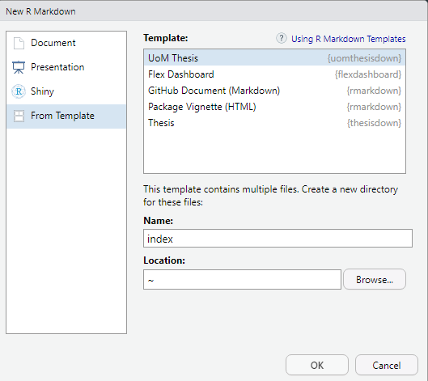

# University of Manchester thesisdown template

This is a fork of [ismayc/thesisdown](https://github.com/ismayc/thesisdown) borrowing some documentation from [rensa/unswthesisdown](https://github.com/rensa/unswthesisdown) designed to produce theses for UoM master and PhD students. The latex template is based on the School of Computer Science guidelines. It is possible to change the faculty and school names to your current affiliation (see `index.Rmd`), just double check that your school is OK with the CS template.

## Installation

To use **uomthesisdown** from RStudio:

1) Install the latest [RStudio](http://www.rstudio.com/products/rstudio/download/).

2) Install the **bookdown** and **uomthesisdown** packages, and restart the R session (or restart RStudio):

```S
install.packages("devtools")
devtools::install_github("rstudio/bookdown")
devtools::install_github("juliov/uomthesisdown")
.rs.restartR()
```

3) Use the **File** > **New File** > **R Markdown...** dialog to select **From Template** and then **UoM Thesis**. **Important: name the folder _index_**



## Usage

Use the "Knit" button to run the example template. Modify the thesis metadata (faculty, author, supervisor, etc) in `index.Rmd`. When you are ready to add new chapters, create the corresponding `.Rmd` file and modify `_bookdown.yml`.

The default output format is PDF. HTML is available but is not compatible with some advance table styling. Note that Word and EPUB output are available, but neither have been modified for UoM: the Word template is from Reed College (so don't submit it!) and the EPUB is, I think, based on the bookdown default (so not great).

If you have any feedback, create an issue, send a PR or [get in touch](mailto:julio.vega@pm.me).
