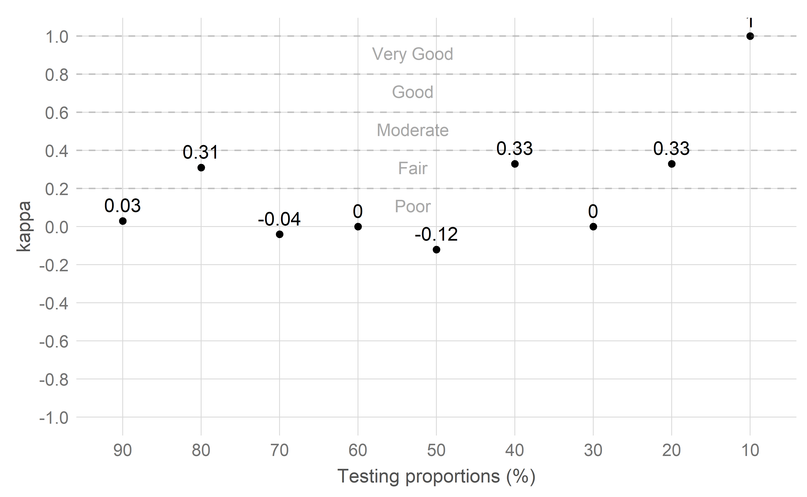

# Introduction {#intro}

I recommend getting familiar with:

1. RMarkdown (see \autoref{rmd-basics} for the basics)
2. Bookdown (see [the docs](https://bookdown.org/yihui/bookdown/))
3. Kable (see [the docs](https://cran.r-project.org/web/packages/kableExtra/vignettes/awesome_table_in_html.html))
4. Kable extra (see [the docs](https://haozhu233.github.io/kableExtra/awesome_table_in_pdf.pdf))

In this chapter I will only expand on bits that are specific to the University of Manchester template and others that I had to Google to achieve something specific in my thesis like long tables, multiple referenes, appendices, citation styles, among others (some of them are covered in the links above).

Modify `index.Rmd` to add your name, supervisors, abstract, acknowledgements and other details. The default output format is PDF. Although you can get your thesis in HTML by uncommenting `thesisdown::thesis_gitbook`, some table styles won't work. In theory it is possible to get your thesis in Word or ePub but I did not test this. You can import new latex packages by adding `\usepackage{...}` to `header-includes` in `index.Rmd`.

Modify `_bookdown.yml` to add or remove chapters from the final PDF. You can reference other sections or subsections in text using `\autoref{myLabel}`, for example: \autoref{rmd-basics} or \autoref{s2:tables}.

This template uses APA as the default citation style. You can change this by downloading the [csl file](https://citationstyles.org/authors/) corresponding to your desired style to the `csl` directory and then update the `index.Rmd` file accordingly.

You can reference a single paper from your bib file using `[@vega2018]` which creates this: [@vega2018]. You can also cite multiple papers at once using `[@vega2018;@braun2006using;@gardner1986confidence]` creating this: [@vega2018;@braun2006using;@gardner1986confidence].

See \autoref{appendix:a1} and \autoref{appendix:a2} for examples of appendices.

## Tables {#s2:tables}

You can add tables with markdown, with kable and with pander (I won't cover the latter).

### Markdown tables

Notice how you can style the content of each cell and add citations.

| Column 1 	| Column 2 [@braun2006using]	| Column 3 	  |
|----------	|-----------------------------|----------	  |
| A        	| _B_      	                  | **C**     	|
| D        	| E        	                  | F @vega2018 |

Table: First example with a basic markdown table

### Kable tables

Kable allows you to work with R dataframes or tibbles which can load CSV files or query databases (among other sources). This is helpful to load the results of your analysis as they come out of whatever pipeline you setup (R, Python, Java, etc.). You can reference tables in your text similary to any other section `\autoref{tab:snippetName}` where snippetName is the name of the code snippet where you call `knitr::kable`. See \autoref{tab:firstTable}.

```{r firstTable, echo=FALSE, warning=FALSE}
table = read.csv("data/appendix/app_comparison.csv", sep = ",")
knitr::kable(table,
              booktabs = TRUE,
              caption.short = "Kable table 1, short caption for table of contents",
              escape = F,
              longtable = T,
              caption = 'First kable table, long caption that will appear above the table. You can even add math symbols $>$ 10')
```

If you want a table to span multiple pages if it does not fit in a single page, add the `longtable = T` option. You can also rename columns, and break their headers into mutiple lines. See \autoref{tab:secondTable}.

```{r secondTable, echo=FALSE, warning=FALSE}
table = read.csv("data/appendix/app_comparison.csv", sep = ",")
knitr::kable(table,
              booktabs = TRUE,
              caption.short = "Kable table 2, short caption for table of contents",
              caption = 'Second table with renamed columns, because we are not holding the table\'s position, latext will decide where to display it',
              escape = F,
              longtable = T,
              col.names = linebreak(c("Project", "Open\nSource", "Column 3", "Column 4"), align = "c"))
```

Using kableExtra you cand style your tables even further (check [the docs](https://haozhu233.github.io/kableExtra/awesome_table_in_pdf.pdf) for a complete reference). In this example, we will adjust the column width, font size, alternate the rows' background color, and make the table keep its position in the document after this paragraph as opposed to a latex-defined position like \autoref{tab:secondTable}. See \autoref{tab:thirdTable}.


```{r thirdTable, echo=FALSE, warning=FALSE}
table = read.csv("data/appendix/app_comparison.csv", sep = ",")
knitr::kable(table,
              booktabs = TRUE,
              caption.short = "Kable table 3, short caption for table of contents",
              caption = 'Third table with different column width and cell style',
              escape = F,
              longtable = T,
              col.names = linebreak(c("Project", "Open\nSource", "Column 3", "Column 4"), align = "c"))  %>% 
kable_styling(latex_options = c("striped", "hold_position"), font_size=20) %>% 
column_spec(1, width = "4cm") %>%
column_spec(2, width = "2cm") %>%
column_spec(3:4, width = "3cm")
```

The only downside of using kables that I found while writing my thesis was adding citations. The way I solved it was creating a basic pander table with the same csv including the `[@citation]` in its content (`pander(table, caption = "", style = "simple", justify = "left")`), generate the PDF, and then copy and paste those cells. This has the drawback that depending on your citation style (for example, if it's numeric) you will have to update the table every time you add or remove a reference form your bib file. For this reason, I would update this table right at the end. If you want to avoid this use a citation style that uses lastnames instead of numbers (for example, 'Vega et. al, 2018' instead of [12]) or use pander (although is not as powerfull with landscape multipage tables).

For the sake of this template, below you cand find three examples of complex landscape and multiple-page tables.

```{r fourthTable, echo=FALSE, warning=FALSE}
table = read.csv("data/chapter1/recordsDataset.csv", sep = "|")
knitr::kable(
  table, "latex",booktabs = TRUE,  longtable = F,
  caption = 'Records collected for each smartphone sensor for p01-p08') %>%
  kable_styling(latex_options = c("repeat_header", "striped"), font_size=11)  %>%
  add_header_above(c(" " = 1, "iOS phones (11 sensors)" = 5, "Android phones (22 sensors)" = 2)) %>%
  landscape()
```

```{r fifthTable, echo=FALSE, warning=FALSE}
table = read.csv("data/chapter1/background_table.csv", sep = "|")

knitr::kable(
 table %>% select(c(1,3:10)), "latex", booktabs = TRUE, longtable = T, escape = F,
 col.names = linebreak(c("Author", "Device", "Duration", "n",
                         "Ground\nTruth", "Measured\nTask/Behaviour", "Clinical\nTarget",
                         "Monitoring","Personalised"), align = "c"),
 caption.short = "Research on naturalistic technology-based monitoring of PD",
 caption = 'Research on naturalistic technology-based monitoring of PD. Column n shows people with Parkinson\'s/Controls') %>%
 kable_styling(latex_options = c("repeat_header", "striped"), font_size=9)  %>%
 column_spec(1, width = "1.4cm") %>%
 column_spec(2, width = "1.7cm") %>%
 column_spec(3, width = "1.5cm") %>%
 column_spec(4, width = "1cm") %>%
 column_spec(5:7, width = "3.6cm") %>%
 column_spec(8:9, width = "1.45cm") %>%
 landscape()
```

```{r sixthTable, echo=FALSE, warning=FALSE}
table = read.csv("data/appendix/aware_sensors_pilot.csv", sep = "|")
knitr::kable(
   table, "latex", booktabs = TRUE, escape = F, align=c("l", "l", "l"), longtable = T,
   col.names = c("Sensor", "Sony Xperia Z3 \nCompact (freq)", "Blu Studio \nEnergy (freq)"),
   caption = 'Aware sensing configuration for the pilot study') %>%
  kable_styling(latex_options = c("repeat_header", "striped", "hold_position"), font_size=10.5) %>%
  column_spec(1, width = "4.5cm") %>%
  column_spec(2, width = "3.5cm") %>%
  column_spec(3, width = "3.5cm")
```

## Figures

You can add figures using R chunks loading a png/pdf/jpg file (See \autoref{fig:figure1}):

```{r figure1,  out.width="200px",  fig.cap="Long caption (kappa $>$ 0.20).",  fig.scap="Figure A, Short caption for table of contents",  out.extra='',  warning = F,  echo = F,  fig.align='center'}



```

You can add figures using R chunks creating the plot on the fly (See \autoref{fig:figure2}):

```{r figure2,  out.width="200px",  fig.cap="Plot generated on the fly",  fig.scap="Figure B, Short caption for table of contents",  out.extra='',  warning = F,  echo = F,  fig.align='center'}

par(mar = c(4, 4, 0.1, 0.1))
plot(pressure, pch = 19, type = "b")

```

## R code

You can import and run R code within your document.

```{r snippetName, echo=T}
library(kableExtra)
library(tibble)
groupA_mean = 1
groupB_mean = 4
```

You can combine text and R variables. This is really useful to automate results reporting. For example, we found that group A had a mean of `r groupA_mean` and group B a mean of `r groupB_mean`. If you don't want to output your code set `echo=F` in the chunk options.